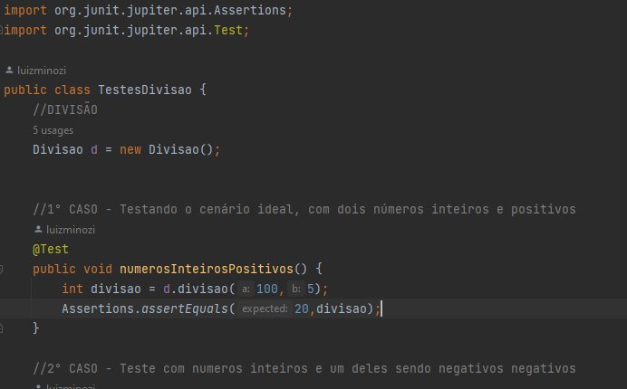

# CalculadoraJUnitTest

## Descrição do Projeto

O código em questão é uma calculadora com as 4 operações básicas da matemática para o usuário realizar.

##Funcionalidades e Comentários

A imagem acima contém um exemplo de uma das operações citadas e os comentários que a pertencem.

## Última atualização 16/11/23

